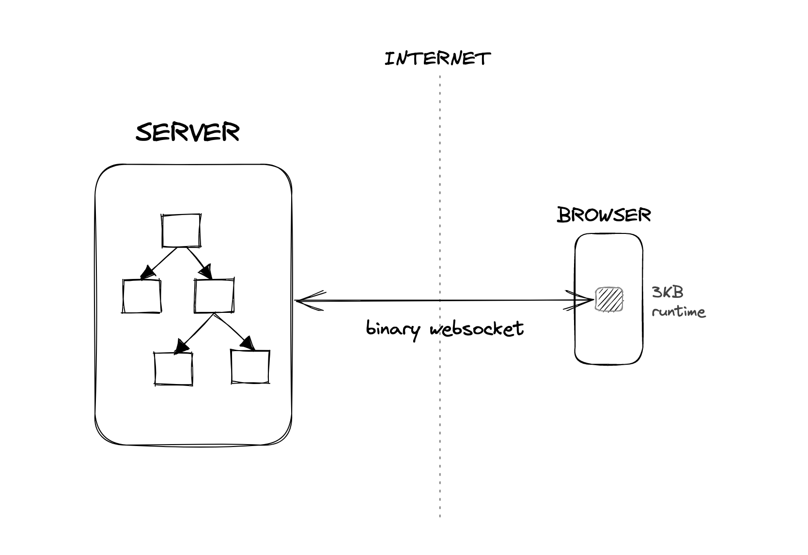

# Seniman

Seniman is a server-driven UI framework that runs your UI components to run on the server, enabling your UI to operate without downloading your component & business logic code to the client. 

Seniman synchronizes the latest UI server state with the browser using a custom binary protocol over WebSocket and a thin ~2KB browser runtime, allowing fast-loading, low-latency user interfaces.

```js
import { useState } from "seniman";

function Counter(props) {
  let [getCount, setCount] = useState(0);
  let onClick = () => setCount(count => count + 1);

  return <div class="counter">
    My counter: {getCount()}
    <button onClick={onClick}>Add +</button>
  </div>;
}
```
Seniman runs on Node.JS and uses familiar JSX syntax & state management APIs, so you can hit the ground running.

## Table of Contents
- [How it Works](#how-it-works)
- [Installation](#installation)
- [Basic Usage](#basic-usage)
- [FAQ](#faq)

## How it Works

At a high-level, Seniman runtime is divided into two parts: the server, and client-side runtimes. Here's how the rough architecture looks like:



On the server-side, Seniman includes a custom runtime to build and maintain your UI component tree, track state changes across components, and manage connections to concurrently-connected browser windows. The server-side runtime is also responsible for generating UI update commands to make sure the browser is able to render the latest UI state. Event system is also implemented on the server-side -- allowing your server-side code to respond to events triggered by the client.

In order to achieve network efficiency, Seniman server communicates to the client using a custom binary protocol over WebSocket, which are then interpreted into actual DOM operations by a ~2kb browser runtime. The result is a low-latency, fast-loading, remotely-driven user interface that feels local over a normal 4G connection.

## Installation

To use Seniman, the packages you need to install are Seniman itself, and the Babel plugin that will transform your Seniman JSX code.

Run the following command to install Seniman:
```sh
npm install seniman
```

And the following for the Babel plugin:

```sh
npm install --save-dev babel-plugin-seniman
```

## Basic Usage

To start off simple, let's create a simple `Hello World` component. Create a new file called `src/index.js` with the following contents:

```js
import { useState } from "seniman";
import { createServer } from "seniman/server";

function Body() {
  let [getCount, setCount] = useState(0);
  let onClick = () => setCount(count => count + 1);

  return <div class="hello-world">
    Hello World! {getCount()}
    <button onClick={onClick}>Add +</button>
  </div>;
}

let server = createServer({ Body });

server.listen(3002);

```

To set up Seniman, you need to configure Babel to use the Seniman plugin. You can do this by adding the following to your `babel.config.json` file:

```json
{
  "plugins": ["seniman"]
}
```

Then, you can run the babel compiler-watcher by running `babel` through `npx`:

```sh
npx babel src --out-dir dist --watch
```

This will watch your `src` directory for changes, and compile them to the `dist` directory. You can then run your code using Node.js:

```sh
node dist/index.js
```

Open up your browser and navigate to `http://localhost:3002`, and you should see a counter that increments when you click the button.

## FAQ

### What happens when the user clicks a button? How does the server know what to update?

When the user clicks the button, the browser runtime will send a `click` event to the server. The server will then execute the `onClick` handler assigned to the element, which will update the UI state, depending on your logic. If there is any change to the UI state, the server will generate a set of DOM operations to update the UI, and send it to the client. The client will then execute the DOM operations, updating the UI. 

This might sound slow, but in most cases, 4G connections are now low-latency enough for the users to not notice the delay. In addition, Seniman is designed to be efficient in terms of network usage -- only the necessary DOM operations are sent to the client. You can feel the latency for yourself, live at our docs page: [seniman.space](https://seniman.space), and decide if it is acceptable for your use case.

### This looks pretty stateful -- what happens when a client loses its connection to the server, or a server goes down?

Seniman is designed to be resilient to network failures. When a client loses its connection to the server, the client will automatically execute connection retries -- and upon reconnection to the existing window session, the server will re-stream the command buffers that are not yet acknowledged by the client, getting the client up to speed with the latest state.

When a server goes down, the client will similarly automatically reconnect to a different server in the cluster -- albeit restarting the session and losing any state that is not persisted to a database. If there is any important UI state you cannot afford to lose to a server crash -- say, a long, multi-input form -- you can persist the state to a database and re-load it when the client reconnects to a different window.

### This looks pretty stateful -- do I get to deploy this normally?

Seniman can be deployed like any other Node.JS application. You can use a process manager like PM2 to manage your Seniman processes, and a reverse proxy like Nginx to load balance your Seniman instances.

In order for your users to have better experience during network reconnection, however, it is recommended to set up client-IP sticky sessions in your reverse proxy. This will help ensure that a client that has disconnected, will reconnect to the same server instance when it comes back online, allowing the client to resume its session without losing any state.

### Is my actual component code downloaded to the client?

No, only the resulting DOM operations are sent to the client -- your component code is never downloaded to the client. This  means you can safely implement sensitive logic (like loading data from a database) or use sensitive data (like secret tokens) within the component code.  

### I have some logic I need running on the client. How do I do that?

While most UI patterns are entirely implementable server-side with Seniman, Seniman also supports running custom logic on the client. Things that naturally need to run on the client like Google Single Sign-On, or custom analytics can be implemented using the `$c` and `$s` syntax.

### Any example of this framework running somewhere? I want to feel how a remotely-driven UI feels like.

Yes -- the documentation site for Seniman is built using Seniman itself! You can access the (currently in-development) site at [seniman.space](https://seniman.space).
